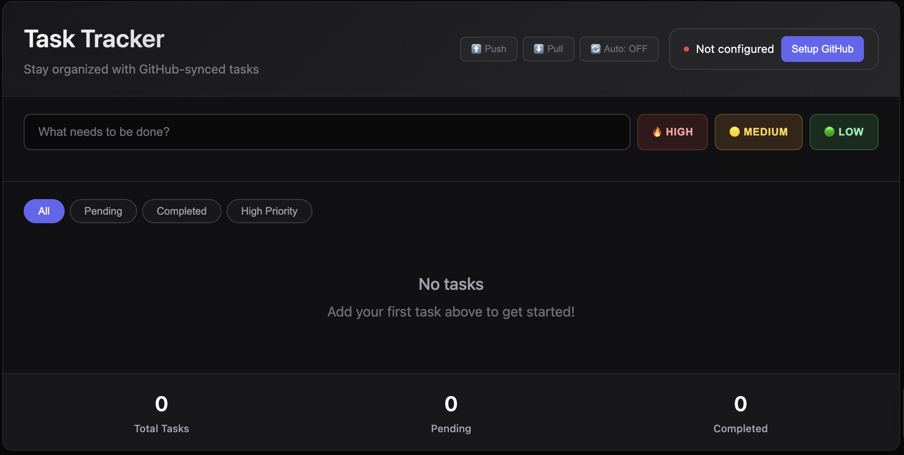

# BasicTaskTracker
A basic task tracker that is backed up on GitHub and is in markdown.
Security is via limiting that the locally stored token can do on GitHub.

## How to Use

1.  **Download:** Save the `task_tracker_app.html` file to your local computer.
2.  **Open in Browser:** Open the file in your preferred web browser (e.g., Chrome, Firefox, Safari).
3.  **Create a GitHub Token:**
    -   Go to [github.com/settings/tokens/new](https://github.com/settings/tokens/new).
    -   Select **"Fine-grained token"**.
    -   Give your token a name (e.g., "TaskTrackerSync").
    -   Under **"Repository access"**, select **"Only select repositories"** and choose the private repository where you want to store your tasks.
    -   Under **"Permissions"**, find **"Contents"** and grant it **"Read and write"** access.
    -   Click **"Generate token"** and copy the token (`github_pat_...`).
4.  **Configure the App:**
    -   In the Task Tracker, click the **"Setup GitHub"** button.
    -   Paste your new **Token** into the token field.
    -   Enter your GitHub **Repository** in the format `username/repo-name`.
    -   Optionally, change the **File Path** for your tasks file.
    -   Click **"Save Repo & Path"**. Your configuration (except the token) will be saved in your browser's `localStorage`.
5.  **Sync:**
    -   Use the **Push** button to send your tasks to GitHub.
    -   Use the **Pull** button to retrieve your tasks from GitHub.

## Security

Some tradeoffs were made to keep things simple.
-   **Fine-Grained Tokens:** The app guides you to create a GitHub token with the absolute minimum permissions required (read/write access to contents in a single repository). This means that even if the token were compromised, the damage would be limited to that specific repository's contents.
-   **Local Storage:** While the GitHub token is stored in `localStorage` for convenience, it's recommended to use a private browser window if you are on a shared computer.
